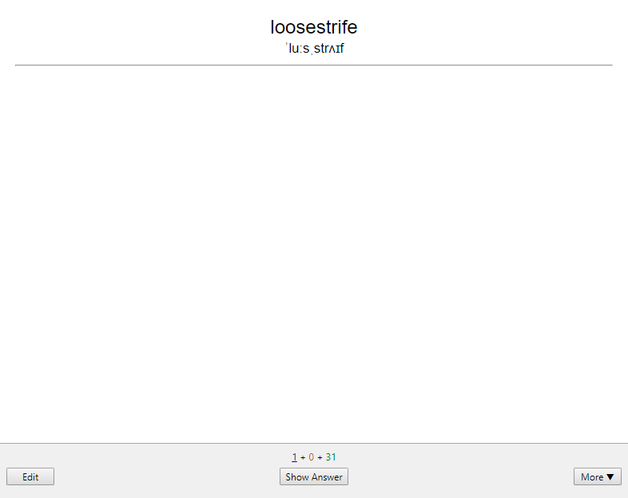
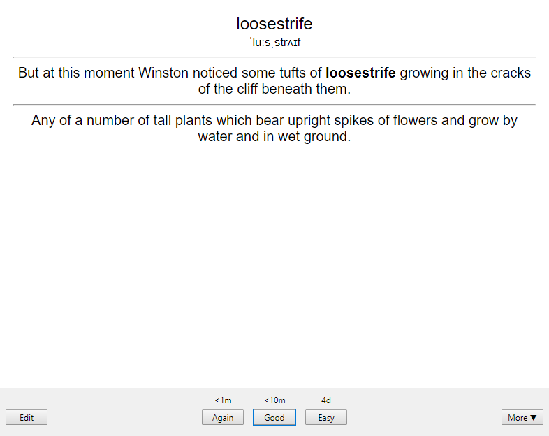

# Convert Kindle Vocab to Anki

## Description

The purpose of this project is for porting the vocabs you learned from your Kindle to [Anki](https://apps.ankiweb.net).

In particular, this script converts `vocab.db` into a format Anki can understand and import.

|  |  |  |
| ------------------------------------ | --------------------------------------------------------- | ---------------------------------- |
| Front of the card                    | Hover to reveal example sentence                          | Back of the card                   |

### In Kindle

Your Kindle records down each word you search for and you can review them in Vocab Builder. These words are written into the database `kindle:/system/vocab.db`, specifically in the `LOOKUPS` database table. The ID and context of the word are cross-referenced to the `WORDS` database table.

### In Anki

Create a new note type for Anki for the import.

1. Pick `Basic (and reversed card)`.
2. In the `Fields...` options, adjust the fields to:

| Order | Field Name       | Explanation                                     |
| :---: | :--------------- | :---------------------------------------------- |
|   1   | Word             | The Vocab, which is not necessary the root word |
|   2   | Pronunciation    | The IPA of the word                             |
|   3   | Example Sentence | The context sentence where you found the word   |
|   4   | Meaning          | Definition of the word                          |

3. In the `Cards...` option, the card templates are as follows (copy and paste them, they work as is).

#### Front Template

```HTML
<big class="word">{{Word}}</big><br>
<small class="ipa">{{Pronunciation}}</small><br>

<hr>
<div class='spoiler'>{{Example Sentence}}</div>
```

#### Styling (shared between cards)

```HTML
.card {
 font-family: arial;
 font-size: 20px;
 text-align: center;
 color: black;
 background-color: white;
}

.spoiler { 
  color: white;
}

.spoiler:hover{
  color: black;
}
```

#### Back Template

```HTML
<big class="word">{{Word}}</big><br>
<small class="ipa">{{Pronunciation}}</small><br>

<hr>
{{Example Sentence}}

<hr id=answer>

{{Meaning}}

<div style='color: white;' class='spoiler'>{{Example Sentence}}</div>
```

### Putting it together

All words and Example Sentences are extracted from the Kindle database file. Phonetics and Meaning are queried from [Merriam-Webster's Dictionary API](https://dictionaryapi.com/products/api-collegiate-dictionary). The four fields are written tab-separated to the specified file.

## Usage

1. Set up your Anki with the new note type as above.
2. Run the program. Use `--help` for usage information and extended options.
3. Import `to_import.tsv` in Anki, pick the note type you made, and allow HTML in fields.

Some notes:

1. You need to [install Rust](https://www.rust-lang.org/tools/install) to compile the code. Run `cargo build --release` to compile.
2. The maximum verbosity is 3.
3. In the `test` subcommand, `Word Key` and `Example Sentences` for each word will be blank because they were meant to be retrieved from the Kindle database.